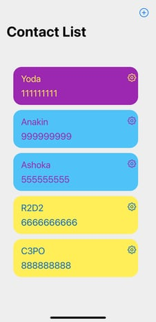
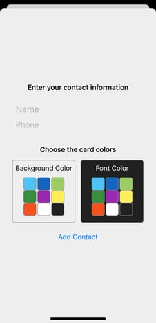
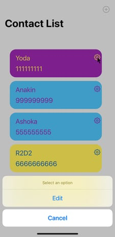
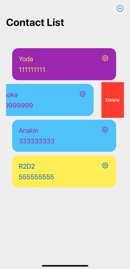

# ContactList_SwiftUI
iOS contact list SwiftUI app

## Introduction
This app is intended to work as a contact list, storing names and phone numbers, working as a database of easy access to all employees of a company.

Included contacts are presented in a vertical list, where you can choose the background color and font color for each individual contact, and this is important if you intend to sort contacts into different groups. For example, developers on a blue background, tech support on a yellow background, and so on (as show in the contact list image bellow)

### Including Contacts
To add a new contact, just click on the add button (upper right side, as shown in the previous image), and then a form sheet will appear.
In this form, you need to include the new contact's name and phone number. You also need to choose the font and background colors by clicking on the specific box into the colors table, as shown in the next image.

### Update Contacts
To update a specific contact, you need to click the gear button (see the contact list image above). A sheetAction will appear and you can click on edit or cancel option.

Clicking on the edit option will open the same form sheet used to include contacts, however now the form will show the data from selected contact. Just refresh the data to update it. See that you need to reset the colors.

### Delete Contacts
The app makes use of the onDelete function to exclude contacts. Once in the Contact List View, you can swipe from right to left across any of the rows in the list, and you should find a delete button appears. You can tap that, or you can also use iOS’s swipe to delete functionality by swiping further, as show in image bellow.

## Technical Information
### Development
The app was built using Swift 5.5.2, the framework SwiftUI, Xcode 13.2.1, and is intended to work on iOS 15.0 or later.

The code is divided into Views, Models, ViewModels and Utilities, following the MVVM design pattern.

The app code includes unit tests for the fetchContact and addContact functions, in both ViewModels. 

All UIs presented in the app were also tested, and you can find it in ContactList_SwiftUIUITests folder inside app project.

Thinking that the purpose of the app is to share contacts between members of a company, or any group of people, we decided to deal with the concurrency through apple's new implementation, async/await. 

the sharing support still needs to be implemented to the app,  but we think async/await can make handle with errors less hard.

### Vapor API

During the app development it was consumed a vapor API. To check the API you can consult the [https://github.com/lpuzer/VaporAPI-ContactList](https://github.com/lpuzer/VaporAPI-ContactList).

The API was initialized using docker, and the initial data (JSON format) for testing the API was defined using [Postmaster](https://www.postman.com).

For the communication between the API and the xcode simulator during the developmente it was necessary to generate an http address using [ngrok](https://ngrok.com) (through the command line "./ngrok http 8080" in the terminal).

The address generated by ngrok must be added to the Constants file, inside the Utilities folder, in the application project, and refreshed any one and half hour.

### Deploy

The app was deployed using the free facility from Heroku. The final version 1.0.0 already is linked to the Heroku data base.

